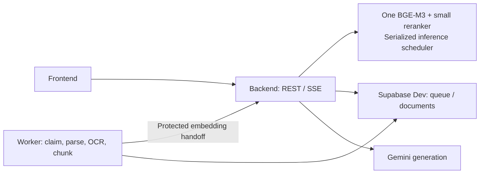

# Proposed local runtime for an 8 GB PC

Status: **APPROVED; IMPLEMENTED; LIVE VALIDATED** (2026-10-05). This profile addresses the observed memory pressure without changing Supabase Dev or the 1024-dimensional embedding schema.

## Evidence and recommendation

This host has 8 GB physical RAM; Docker exposes about 3.7 GiB. An existing 57-chunk Dev document occupied the CPU worker while new smoke uploads remained queued. Parsing/chunking and model initialization were observed; embedding completion was not. This establishes a resource bottleneck, not a measured proof of OOM or a completed ingestion benchmark.

Currently, the worker loads BGE-M3 for ingestion, while the API independently loads BGE-M3 for queries and the large BGE reranker. The shared cache saves downloads and disk space, but each process still owns model memory. Batch size one and two inference threads are already configured.

Recommend keeping the three Compose services and BGE-M3, making the backend the sole model owner, and replacing the local reranker with `cross-encoder/mmarco-mMiniLMv2-L12-H384-v1`. The user explicitly approved this model and worker/API architecture change on 2026-10-05. Production and Modal model defaults remain unchanged; Compose enables the development-only profile.

## Memory comparison and model choices

These are approximate FP32 weight-size calculations, **not measured peak RAM**. Python, PyTorch, tokenizers, activations, OCR, frontend, Docker and Windows require additional memory. Loading can temporarily require more than steady-state inference.

- Current full path: two BGE-M3 copies plus BGE reranker, approximately 6.81 GB (6.34 GiB) of model weights alone. BGE documentation lists BGE-M3 at 2.27 GB; the current reranker weight file is also 2.27 GB. [BGE documentation](https://bge-model.com/tutorial/1_Embedding/1.2.1.html), [reranker files](https://huggingface.co/BAAI/bge-reranker-v2-m3/tree/main).
- Recommended: one BGE-M3 plus multilingual MiniLM, approximately 2.741 GB (2.55 GiB) of weights, about 60% less. The MiniLM weight file is 471 MB. Its model card identifies mMARCO training; that dataset includes Vietnamese. This supports testing it for the repository's Vietnamese documents, but does not establish equivalent retrieval quality. [Model card](https://huggingface.co/cross-encoder/mmarco-mMiniLMv2-L12-H384-v1), [weight files](https://huggingface.co/cross-encoder/mmarco-mMiniLMv2-L12-H384-v1/tree/main), [dataset languages](https://huggingface.co/datasets/unicamp-dl/mmarco).
- Smaller alternative: one BGE-M3 plus `cross-encoder/ms-marco-MiniLM-L6-v2`. Its 22.7 million parameters imply roughly 91 MB of FP32 weights, giving approximately 2.36 GB total. The model is English-focused, making it a weaker choice for Vietnamese material. [Model card](https://huggingface.co/cross-encoder/ms-marco-MiniLM-L6-v2).

Sharing BGE alone while retaining the large reranker still needs roughly 4.54 GB of weights. Changing only the reranker while retaining duplicate BGE instances also exceeds the current Docker budget. Both changes are needed. The recommended design remains tight at 3.7 GiB and must be measured before claiming this PC can run the complete flow.

## Proposed service boundaries

The worker retains durable queue ownership, parsing, OCR and chunk persistence. It does not construct an embedding model. A protected internal backend operation embeds the claimed document through the existing embedding service and persists vectors. The worker completes the durable job only after committed embeddings succeed; transport/model failures use the existing retry/failure RPCs.

The internal operation uses a backend/worker-only HMAC token derived from the existing server-side service key and a fixed local handoff context. The raw service key is not sent to the internal API, no new secret setup is needed, and this token never reaches the frontend. Its typed request identifies the claimed job and attempt; backend authorization derives document ownership from the database and verifies the current processing attempt. Do not trust caller-supplied user/workspace identities. Preserve owner-scoped sessions, existing RLS and service-only queue RPC boundaries. Retries must be idempotent, with duplicate concurrent requests coalesced and stale attempts rejected. Cancellation/restart must never acknowledge completion before persistence.

Load models once in a background lifespan task, off the event loop, with readiness exposed separately from lightweight API health. Frontend startup remains independent of ML warmup; the worker waits for model readiness before claiming. A single inference scheduler serializes memory-heavy embedding/reranking, yields between ingestion micro-batches and gives interactive queries priority without starving ingestion. Preserve batch size one and bounded CPU threads.

Bound model input lengths to control activation memory. Choose limits after profiling representative English/Vietnamese inputs. Long inputs are split into tokenizer-aligned windows without removing any source characters. Local document/query embeddings pool every window into one normalized vector for the canonical chunk; the local reranker scores passage/query windows and uses their maximum relevance. Stored chunk text, identifiers and page provenance remain intact, so no chunk-table rewrite or schema change is needed. Local windowed embeddings carry a distinct version. Existing user documents are not automatically reprocessed.

BGE-M3 and its 1024-dimensional vector contract stay intact. No schema migration is expected for sharing models or changing rerankers. Reranker activation/score normalization is covered by focused tests and live English/Vietnamese positive and unrelated-negative retrieval fixtures. Hybrid retrieval, RRF, reranking, document-first gating, web fallback and Gemini SSE remain required.

## Implementation scope after approval

Targeted changes would touch `backend/app/core/config.py`, `backend/app/main.py`, `backend/app/ml/loader.py`, the BGE/reranker providers, a small shared inference scheduler, typed internal API/schema definitions, the worker handoff client and queue runner, and ingestion/embedding services. Input splitting would touch `backend/app/services/ingestion/chunker.py` only as needed to preserve evidence within the measured budget. Update Compose, `.env.example`, runtime docs and focused tests. No new queue framework, model server service, GPU requirement or paid embedding provider is proposed.

## Acceptance before declaring completion

1. Start all three services with `docker compose up --build`; frontend/API respond during warmup; cached weights are reused after restart.
2. Prove that only the backend owns embedding/reranking weights. Measure total Docker memory during cold load, scanned PDF OCR, ingestion and concurrent chat. Target at least 0.3 GiB of headroom within the current Docker allocation; check host responsiveness and OOM/restarts. If this fails, report it rather than promising an 8 GB solution.
3. Validate job attempt ownership, idempotent handoff, retry/backoff, interrupted work and completion after committed vectors.
4. Exercise real small PDF, scanned PDF and DOCX inputs; confirm full text/page preservation and 1024-dimensional vectors. Measure CPU processing and retrieval latency separately.
5. Check English/Vietnamese ranking and relevance gates, then real Gemini grounded answers, page citations, incremental SSE, cancellation/retry and persisted state after reload/login.
6. Rerun relevant backend/frontend checks and the production image build. Keep production and automatic remote migration pushes outside scope.

## Live validation result

The refreshed profile ran under the 3.717 GiB Docker allocation. Kernel cgroup samples recorded a 1.851 GiB peak for the backend workload, at least 1.464 GiB available to Docker at the low point, and no `oom` or `oom_kill` events. Docker swap use peaked at about 0.638 GiB, so this machine has usable headroom but cold CPU work remains slow.

The disposable Dev smoke completed successfully and removed its temporary user, workspace, documents, conversation and storage objects. It verified normal PDF, scanned-PDF OCR, and Vietnamese DOCX ingestion, one attempt per job, original-file retrieval, persisted 1024-dimensional vectors, English and Vietnamese positive retrieval, an unrelated negative relevance gate, Gemini grounded SSE with citations, stream cancellation, and persistence after logout/login. The scored English retrieval finished in 3.85–3.94 seconds after warmup; grounded Gemini TTFT was 6.24–9.65 seconds.

Backend verification: 272 passed, four skipped, one warning; focused local-runtime checks: 22 passed. Frontend: 28 tests passed; type checking and production Docker builds passed. The observed API 503 was a Supabase Auth `ReadTimeout`; bounded transport retry and the local 15-second timeout are covered by tests. The original browser `Failed to fetch` has no captured reproduction, so its cause remains unproven.
