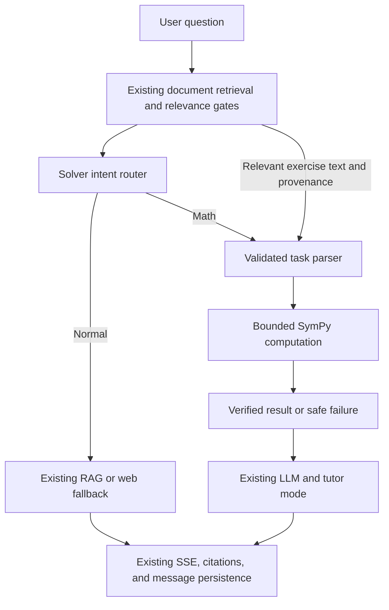

# Phase 9.1 — Verified Math Solver

The existing chat service retrieves and gates workspace documents before routing
mathematical requests. Normal questions keep the existing RAG/web fallback path.
For math, a conservative English/Vietnamese parser produces a validated task;
SymPy performs symbolic computation, and the existing LLM provider explains or
selects guidance according to the existing `chat_mode` field.

Supported operations are arithmetic/symbolic calculation, single-variable
algebraic equations, derivatives, indefinite integrals, and simplification.
For example, `Giải phương trình x^2 - 5x + 6 = 0`,
`Tính đạo hàm của x^3 + 2x`, and `Calculate sqrt(16)+2` produce structured tasks.
Elementary functions include `sqrt`, `sin`, `cos`, `tan`, `exp`, `log`, and `abs`.
Variables are real-valued single letters; `pi` and `E` are constants. Equations are solved
over the reals, with rational polynomial degree at most eight. Indefinite
integrals include a reminder to add `C`. Simplification preserves restrictions
from the original expression's domain.

For `Giải bài 7 trong tài liệu`, the parser requires the matching exercise label
in gate-approved document chunks. It combines adjacent retrieved chunks from
the same document, never fetches unrelated chunks, and rejects missing,
incomplete, or conflicting statements. Source chunk IDs remain attached to the
task internally, so prompt evidence and document citations retain provenance.
A direct math expression provides its own computational input and can be
verified without uploaded documents or a web search. Missing document exercises
ask for the statement; web snippets cannot replace the uploaded exercise.

## Tutor presentation

- **Light Guidance:** The complete result stays internal. The LLM selects one
  vetted conceptual hint. Only the selected hint is emitted, so malformed output,
  prompt injection, or a model volunteering the answer cannot leak final roots.
- **Detailed Guidance:** The LLM selects vetted intermediate guidance steps;
  the learner completes the last step. This phase uses a bounded hint catalog,
  rather than unrestricted generated explanations, to enforce answer withholding.
- **Full Solution:** The LLM streams the explanation with authoritative solver
  context. The backend appends the exact verified result and domain notes, so the
  final result is delivered independently of model formatting.

Document evidence remains authoritative for document content. Mathematical
computation uses the solver result. SymPy receives no document citation; citation
markers still map only to retrieved sources. If parsing or computation fails,
the response explicitly states that calculation verification was unavailable
and provides explanatory guidance or requests a complete statement.

## Safety, contracts, and operation

`backend/app/tools/` separates intent routing, extraction, computation, and
presentation. `backend/app/schemas/math_solver.py` validates tasks and results,
rejecting extra fields, unsupported operations, and conflicting expressions.
There is no LLM code generation or general string evaluation. An allowlisted
Python syntax tree is manually converted to SymPy objects: attributes, imports,
indexing, comprehensions, arbitrary calls, and excessive exponents are rejected.
Symbolic work runs outside the event loop in a terminable child process, with
at most two computations per API process. `MATH_SOLVER_TIMEOUT_SECONDS` defaults
to five seconds and includes child startup; capacity exhaustion/timeouts fall
back safely. Structured logs include operation, intent, source, duration, success,
and error category, without expressions or document text.

The SSE terminal payload and synchronous chat response optionally expose
`solver: {used, type: "math", operation, verified}`. They do not expose computed
answers separately from the mode-controlled response. Messages have no general
metadata column, so solver status is response-only; content and existing document
citations persist through the current service. No database migration is needed.
The optional UI badge is deferred; the TypeScript streaming contract supports
solver status. Existing CPU/GPU locks already pin SymPy 1.14.0; it is now a direct
dependency in `backend/requirements.txt`.

## Validation and limitations

Run `.venv/Scripts/python.exe -m pytest backend/tests` from the repository root,
and `npm test` plus `npx tsc --noEmit` in `frontend`. New backend tests cover the
five operations, bilingual routing/parsing, domain restrictions, malicious input,
structured validation, timeouts, real child-process execution, HTTP/SSE chat,
retrieved exercises, hint withholding, citation persistence, and safe failures.

The parser deliberately rejects unrestricted word problems, LaTeX/OCR-specific
notation, multivariable systems, multiple tasks, unsupported assumptions, and
ambiguous references. There is no structured LLM task-extraction abstraction in
the existing provider, so this phase uses deterministic extraction instead of
adding a new classification call to every request. Full-solution explanations
remain LLM-generated; only the appended final result is deterministically
controlled, and prose/intermediate-step correctness is not independently checked.
Real Gemini/Supabase validation requires configured external services; tests use
existing service doubles and real SymPy. Nothing is deployed by this phase.

Validation executed for this implementation:

- Solver-focused backend tests: **88 passed**.
- Full backend suite: **386 passed, 4 skipped, 1 failed**. The remaining failure is
  the existing `test_modal_gpu_resource_and_cpu_function_configuration` assertion:
  it expects a T4 GPU, while the unchanged `backend/deploy/modal_app.py` uses a CPU
  image and has `gpu=INGESTION_GPU` commented out. The isolated test also fails;
  the same deployment configuration is present in Git HEAD. This phase does not
  change that production configuration.
- Frontend suite: **35 passed**, including the new split-UTF-8 SSE solver contract test.
- Frontend TypeScript (`npx tsc --noEmit --incremental false`), ESLint, Python
  compilation, and `git diff --check`: **passed**.
- Frontend build: **passed** using the existing process-only
  `NEXT_PUBLIC_DEPLOYMENT_TARGET=local` option. The first build with the local HTTP
  API URL and no local-target flag was correctly rejected by the production HTTPS
  guard. No environment file was modified.

Created files: `backend/app/schemas/math_solver.py`,
`backend/app/tools/{__init__,math_solver,math_task_parser,solver_router,math_presentation}.py`,
`backend/tests/test_math_solver.py`, `backend/tests/test_math_chat.py`,
`frontend/tests/math-solver-contract.test.mjs`, and this document.

Modified files: `backend/requirements.txt`, `backend/app/core/config.py`,
`backend/app/rag/prompt_builder.py`, `backend/app/services/rag_service.py`,
`backend/app/schemas/chat.py`, `backend/app/api/v1/chat.py`,
`frontend/src/lib/api.ts`, and `README.md`. Pre-existing Docker/frontend configuration
edits are preserved. Dependency locks, ingestion, deployment files, and secrets
are not changed by Phase 9.1.

For Phase 9.2, consider broader structured extraction with explicit assumptions,
exercise-aware chunking, richer verified intermediate guidance, and mathematical
claim validation for generated explanations. Physics and Chemistry solvers are
not implemented.
